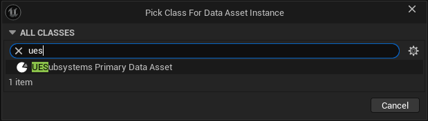
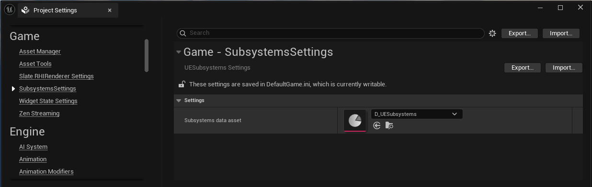
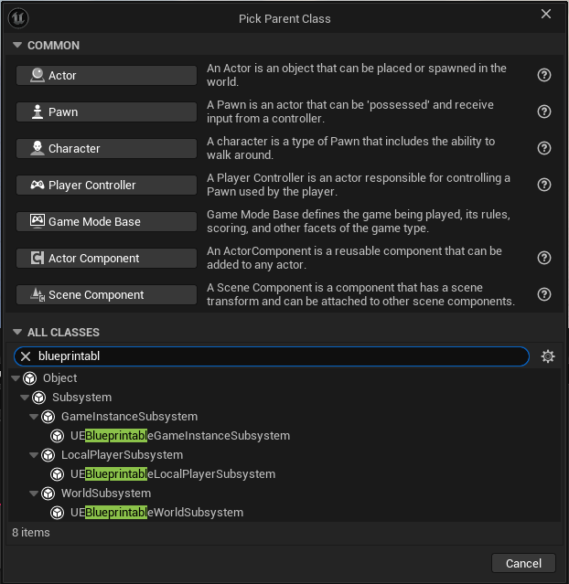
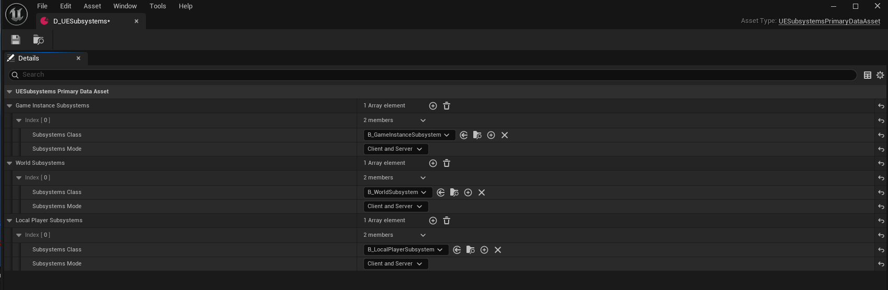

# UESubsystemsPlugin
Unreal Engine plugin that allows you to create subsystems using Blueprints.

## Features
Allows you to create GameInstance, World, and LocalPlayer Subsystems using Blueprints,
add and edit UPROPERTY in C++ Subsystems.

## Installation
Copy repository to Plugins/UESubsystems
or add as submodule:
'git submodule add https://github.com/yakovfil/UESubsystemsPlugin.git Plugins/UESubsystems'

## Setup

DefaultGame.ini 
[/Script/UESubsystems.UESubsystemsSettings]
UESubsystemsAsset=/Game/D_UESubsystems.D_UESubsystems

## Unreal Engine Versions

Plugin is compatible with 5.0+ engine versions

## License

Plugin is available under the MIT license. See the LICENSE file for more info.

## Examples
